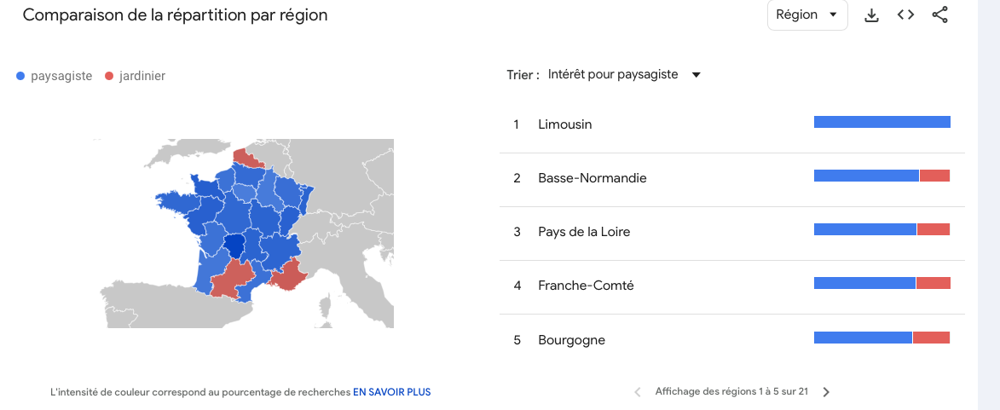

# Analyse et Optimisation SEO pour un site de paysagiste

## Mots-clés principaux
- **jardin**
- **écologique**
- **paysagiste**
- **entretien**
- **aménagement**
- **réalisation**
- **architecture**

## Analyse des recherches
### Volume de recherche
- **"Paysagiste Lyon"** : Volume de recherche mensuel de **1,6k**.

**Conclusion** : Il est préférable d'utiliser le terme **"paysagiste"** plutôt que **"jardinier"**, car il est plus recherché et spécifique.

---

## Étude de la concurrence
### Top recherches
1. **Olivier Berthet (Yoast SEO)** https://www.olivier-berthet-paysagiste.fr : Utilisation du plugin WordPress pour optimiser le contenu. Balise Title "Lyonnais, paysagiste..."
contient une carte ou l'on peut retrouver la société. 

2. **Scenes-Exterieures** https://www.scenes-exterieures.com : Utilisation des termes "architecte paysagiste à Lyon" et "aménagements extérieurs" dans la balise title. 

3. **Osio paysagiste** https://www.osio-paysagiste.com : contient une carte ou l'on peut retrouver la société. 
pas le mot "paysagiste, Lyon" dans la meta description mais dans la balise title. 

### Points communs dans les sites concurrents :
- Présentation de l'équipe.
- Formulaire de contact.
- Réalisations détaillées avec chiffres et statistiques.

---

## Questions fréquentes sur le métier de paysagiste

Ce schéma montre les questions les plus fréquentes posées par les internautes. 
Il est judicieux d'intégrer ces questions dans le site pour apporter des réponses claires et concises :
- **Quel budget prévoir ?**
- **Quand faire appel à un paysagiste ?**
- **Quels services propose un paysagiste ?**

---

## Analyse des tendances de recherche

Ce graphique montre l'évolution des recherches pour le terme **"paysagiste"** dans la région Rhône-Alpes :
- **Période de pic** : Mars à mai.
- **Reprise d'intérêt** : Septembre.

**Recommandation** : Adapter la stratégie de contenu pour capitaliser sur ces périodes clés.

---

## Recommandations générales
- Utiliser des mots-clés spécifiques comme **"paysagiste écologique"** et **"aménagements extérieurs"**.
- Répondre aux questions courantes des internautes pour améliorer l'expérience utilisateur et le référencement.
- Mettre en avant des réalisations chiffrées et visuelles (avant/après, graphiques, etc.).
